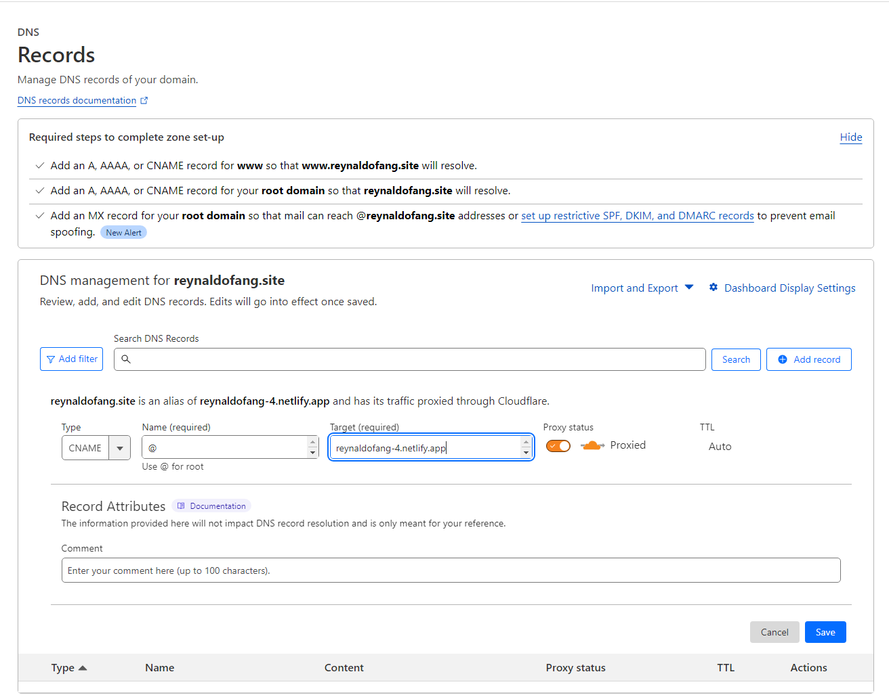

<h1>Bonjour!~ my name is Reynaldo Fang </h1>

This is assignment in week 4 on Full-Stack Engineering - Frontend Infra **(Deployment,Networking,Domain,Workflow).**

If you want to follow me on social media, you can directly click the link below.

## How to Deploy Domain 💻⚙

### Step 1

First you have to buy a domain at [Niagahoster](https://www.niagahoster.co.id/)

On the domain name, it's up to you to put the domain name according to your own needs.

After choosing a domain name is done, make a payment.

### Step 2

After you have done step 1, you log in or create a new ID on [Cloudfare](https://www.cloudflare.com/).

to set up our CDN (Content Delivery Network). 

After you have changed the nameservers on Niagahoster,  you have to add a new DNS record.

| Type | CNNAME |
| Name | @  |
| Target | Your Domain In Netlify |